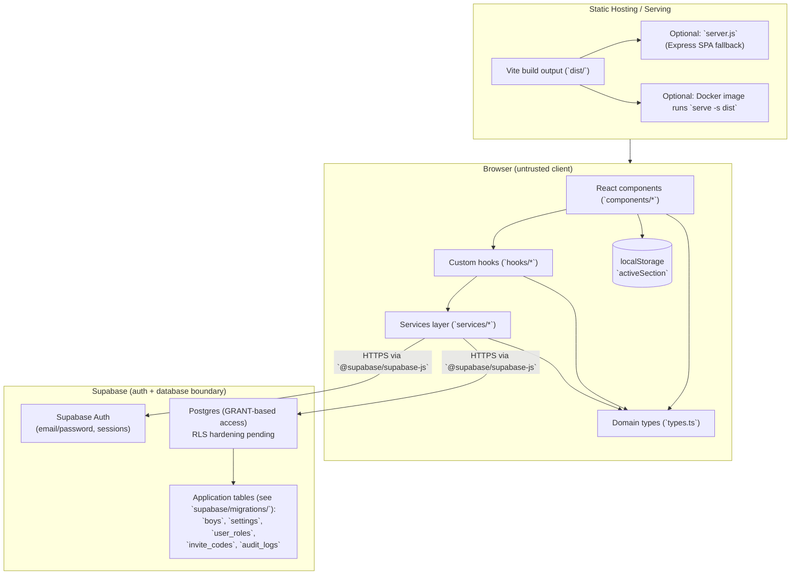

# Architecture Overview

BB Manager is a client-side React + TypeScript single-page app for managing Boys’ Brigade
members (“boys”), squads, and weekly marks across two logically separate sections:
`company` and `junior`.

The architecture is intentionally backend-light: the browser talks directly to Supabase
(Auth + Postgres) via `@supabase/supabase-js`. There is no custom application server for
business logic. The only server code in-repo (`server.js`, `Dockerfile` using `serve`) is
for serving static assets with SPA fallback routing.

Core responsibilities:
- Authenticate users (email/password via Supabase Auth) and load an application role.
- Provide CRUD for members and mark entry workflows with section-specific rules.
- Compute dashboards client-side from loaded roster + marks.
- Record an audit trail of significant actions and support “revert” for most changes.

Primary constraints and implications:
- Online-only: all reads/writes happen against Supabase; no offline cache (no IndexedDB).
- Trust boundary is the database: client-side permission checks are UX only; enforcement
  currently relies on Postgres GRANTs and constraints. Row Level Security (RLS) is
  security-critical and is not yet enforced for the application tables.
- Navigation is an in-memory view state machine in `App.tsx` (no React Router), so URLs
  are not the source of truth for page state.
- Section separation is handled by passing `section` in queries and storing the active
  section in `localStorage`.

> TODO: RLS hardening is pending. Document/implement policies and verify table-level GRANTs
> are least-privilege (schema and GRANTs are tracked in `supabase/migrations/`).

## Goals & Non-Goals

**Goals**
- Keep infrastructure minimal: static hosting + Supabase.
- Make data flow predictable: UI → hooks → `services/*` → Supabase.
- Maintain strict conceptual separation between `company` and `junior` data and rules.
- Provide auditability and reversibility for admin/officer operations.
- Keep the app understandable without a global state framework (Redux, etc.).

**Non-Goals**
- Offline-first or local caching/sync.
- Server-side rendering, SEO-oriented routing, or deep-linkable URLs.
- A bespoke backend/API layer inside this repo.
- Strong consistency across concurrent editors (last-write-wins is the default).
- Comprehensive automated testing (no test runner is present today).

## High-Level System Diagram

## Major Components

1. **App Shell & Navigation (`App.tsx`, `components/Header.tsx`)**
   - Responsibility: top-level orchestration (auth gating, section selection, page view
     switching, modals/toasts, unsaved-change confirmation).
   - Boundary: does not perform Supabase queries directly; delegates to hooks/services.
   - Deep dive: [docs/05-component-library.md](docs/05-component-library.md) and
     [docs/07-hooks-and-state.md](docs/07-hooks-and-state.md).
   - Ownership: UI platform layer.

2. **Page Components (`components/*Page.tsx`)**
   - Responsibility: implement user workflows (roster CRUD, weekly marks entry, dashboards,
     audit log + revert, settings, global settings, signup/login).
   - Boundary: should call `services/*` for data access; some pages also call `createAuditLog`.
   - Deep dive: [docs/05-component-library.md](docs/05-component-library.md).
   - Ownership: product/features.

3. **Custom Hooks (`hooks/*`)**
   - Responsibility: cross-cutting state and coordination:
     - `useAuthAndRole`: subscribes to Supabase auth changes; loads role from `user_roles`.
     - `useSectionManagement`: persists/clears `activeSection` via `localStorage`.
     - `useAppData`: loads `boys` + section `settings` for the active section.
     - `useUnsavedChangesProtection`: blocks navigation/section switch/sign-out when dirty.
     - `useToastNotifications`: in-app notifications.
   - Boundary: hooks orchestrate but generally do not own persistence beyond `localStorage`.
   - Deep dive: [docs/07-hooks-and-state.md](docs/07-hooks-and-state.md).

4. **Services Layer (`services/*`)**
   - Responsibility: centralized Supabase client and data operations.
     - `supabaseClient.ts`: creates the Supabase client from `import.meta.env`.
     - `supabaseAuth.ts`: wraps common auth operations + auth state subscription.
     - `db.ts`: CRUD for `boys`, `audit_logs`, `invite_codes`, `user_roles`; also includes
       validation helpers (e.g., mark validation).
     - `settings.ts`: per-section settings in the `settings` table.
   - Boundary: should be the only place that knows table/column mappings and query shapes.
   - Deep dive: [docs/06-data-and-services.md](docs/06-data-and-services.md).

5. **External Backend (Supabase)**
   - Responsibility: authentication and persistence; database schema and privileges are
     managed via Supabase migrations (`supabase/migrations/`).
   - Boundary: anything “security-sensitive” must be enforced in the database. Today the
     access model is primarily GRANT-based; RLS hardening is pending.
   - Deep dive: [docs/02-architecture.md](docs/02-architecture.md) and
     [docs/09-database-and-migrations.md](docs/09-database-and-migrations.md).

6. **Build & Deploy Tooling (Vite, `vercel.json`, `Dockerfile`, `server.js`)**
   - Responsibility: bundle the SPA (Vite), serve it via static hosting or simple servers,
     and configure SPA rewrites for hosts.
   - Deep dive: [docs/03-getting-started.md](docs/03-getting-started.md) and
     [docs/04-deployment.md](docs/04-deployment.md).

## Data Flow & State Management

**State “sources of truth”**
- Supabase Postgres is the source of truth for domain data (`boys`, `settings`, logs, etc.).
- Supabase Auth session is managed by `@supabase/supabase-js` (client-side storage).
- `localStorage['activeSection']` selects which section’s data is currently loaded.
- In-memory React state (hooks/components) holds the working set (`boys`, `settings`, UI state).

**Primary data loading path**
1. `App.tsx` renders auth-gated UI.
2. `useAuthAndRole`:
   - Reads current session (`getCurrentUser`) and subscribes to auth changes.
   - Loads the role from `user_roles` for the authenticated `uid`.
   - If no role exists: sets `noRoleError` and signs the user out.
3. `useSectionManagement` determines `activeSection` from `localStorage`.
4. `useAppData` loads:
   - `fetchBoys(activeSection)` from `services/db.ts`
   - `getSettings(activeSection)` from `services/settings.ts`

**Write flows**
- **Member create/update/delete**
  - Page/components call `createBoy`, `updateBoy`, `deleteBoyById` (and create audit logs).
- **Weekly marks entry**
  - `WeeklyMarksPage` computes per-boy mark updates and calls `updateBoy` per changed boy.
  - One audit log entry is created with old snapshots for revert (`revertData.boysData`).
- **Settings**
  - `SettingsPage` writes via `saveSettings` and logs `UPDATE_SETTINGS` with prior settings.
- **Invite codes**
  - Generated/edited/revoked via `services/db.ts` + `GlobalSettingsPage` UI.
  - Signup validates a code (`fetchInviteCode`), signs up in Supabase Auth, writes `user_roles`,
    then marks the code used via `updateInviteCode(..., { signup: true })`.
- **Audit log revert**
  - `AuditLogPage` reads `revertData` from the original log and applies the inverse operation.
  - A new `REVERT_ACTION` log is created that links to the reverted log (`revertedLogId`).

**Caching**
- No offline cache; the in-memory state is refreshed via `refreshData()` calls.
- Error handling is mostly “fail and show UI error/toast”; no generalized retry/backoff.

## Key Architectural Decisions

- **Direct-to-Supabase data access**: no bespoke API server; reduces infra and latency.
- **Services layer as boundary**: Supabase query details live in `services/*` to avoid
  scattering table knowledge across UI.
- **In-app view state machine (no router)**: `App.tsx` controls page selection via `View`
  (`types.ts`), simplifying navigation but sacrificing deep links and URL history.
- **Section-based partitioning**: data queries always include a `section` dimension; UI
  styling and mark rules are also section-specific.
- **Embedded marks on `Boy` records**: marks are stored as an array on each boy (JSON-like
  structure), keeping reads simple but making updates heavier.
- **Audit log “snapshot” reverts**: revert uses stored prior-state snapshots (`revertData`)
  rather than event replay.
- **Client-side validation**: `services/db.ts` validates marks (ranges/format) before writes
  to prevent obvious bad data.

> TODO: Capture these as ADRs if the project expects long-lived evolution.

## External Dependencies & Integrations

- **Supabase (external)**
  - Supabase Auth: email/password signup/sign-in, session management.
  - Supabase Postgres: tables used by the app.
  - Trust boundary: the only place authorization can be reliably enforced; today access is
    primarily GRANT-based and RLS hardening is pending.

- **Client libraries**
  - `@supabase/supabase-js`: HTTP client for Auth and PostgREST.
  - React (`react`, `react-dom`), Vite, TypeScript.

- **Styling toolchain**
  - Tailwind CSS compiled via PostCSS (`src/index.css`, `tailwind.config.js`).

- **Serving/runtime**
  - Optional Express server (`server.js`) for static serving + SPA fallback.
  - Docker runtime uses `serve -s dist`.

- **External assets**
  - Logos/backgrounds/icons are referenced by remote URLs (e.g., `postimg.cc`).
  - Trust boundary: requests to these hosts leak client IP and access timing.

> TODO: Document the current GRANT model and the planned RLS policies (RLS is not yet enforced).

## Failure Modes & Resilience

- **Missing Supabase env vars**
  - `services/supabaseClient.ts` throws at import time if `VITE_SUPABASE_URL` or
    `VITE_SUPABASE_ANON_KEY` is missing → app fails fast.
- **Network/Supabase outage**
  - Reads/writes throw; UI surfaces errors/toasts (`dataError`, per-action try/catch).
  - No automatic retries/backoff; user must retry or refresh.
- **Auth session expires / user signs out**
  - Auth subscription updates state; app clears loaded data on logout.
- **User has no role**
  - `useAuthAndRole` signs out and shows an “Access Denied” flow (`noRoleError`).
- **Authorization denied (DB permissions)**
  - Operations fail with errors (today: GRANTs; future: RLS); UI generally displays messages but cannot recover.
- **Concurrent edits**
  - No conflict detection/merging; last write wins at the row level.
- **Large payload failures**
  - Updating marks rewrites the full marks array for each boy; may hit request/row size limits.

> TODO: Define a consistent retry strategy and error UX for transient failures.

## Scalability & Performance Considerations

- **Roster load is “fetch all”**
  - `fetchBoys(section)` loads all members for a section into memory; dashboards compute
    stats client-side.
  - Likely fine for small sections; may degrade for large rosters.

- **Marks stored inline**
  - Marks are an array on the boy record; write amplification grows with history length.
  - Weekly updates can issue many parallel `updateBoy` calls.

- **Audit logs are unpaginated**
  - `fetchAuditLogs` loads logs and merges global + section logs in memory; no pagination.

- **Rendering**
  - Dashboards use `useMemo` for derived data, but work is still proportional to roster size
    and mark history length.

> TODO: If scale becomes an issue, consider normalizing marks into a separate table and
> adding pagination for audit logs/invite codes.

## Security Model

- **AuthN**
  - Supabase Auth email/password (`services/supabaseAuth.ts`).
- **AuthZ**
  - Application roles live in `user_roles` and are loaded client-side.
  - Some client/service functions enforce role checks (e.g., only admins/captains can manage
    invite codes and roles).
  - **Critical**: client-side checks are bypassable. Today the database relies primarily on
    table-level GRANTs (see `supabase/migrations/`) and does not enforce row-level isolation.
    RLS hardening is pending for per-role/per-section enforcement.

- **Secrets flow**
  - `VITE_SUPABASE_URL` and `VITE_SUPABASE_ANON_KEY` are embedded in the client bundle.
  - No service-role key is present in this repo (and must never be shipped to browsers).

- **Sensitive data**
  - Names and marks are personal data; audit log `revertData` can store snapshots of prior
    state (potentially containing the same sensitive fields).
  - Access to `audit_logs`, `invite_codes`, and `user_roles` is security-sensitive and must be
    locked down (today: GRANTs; future: RLS).

> TODO: Add a documented threat model and explicitly list which roles can read/write each
> table (including audit logs and revert data).

## Development & Deployment Model

- **Local development**
  - Uses the Vite dev server and talks to Supabase directly from the browser.
  - Requires `VITE_SUPABASE_URL` and `VITE_SUPABASE_ANON_KEY` at build/dev time.
  - Runbook: [docs/03-getting-started.md](docs/03-getting-started.md).

- **Production build**
  - Produces a static SPA (`dist/`) that can be hosted on any static host.
  - `vercel.json` provides rewrite-to-root behavior for SPA routing.
  - Runbook: [docs/04-deployment.md](docs/04-deployment.md).

- **Serving options**
  - Served by a static host, or optionally via `server.js` (Express SPA fallback) or Docker.
  - See [docs/04-deployment.md](docs/04-deployment.md) for supported hosting patterns.

- **CI/staging**
  - No CI configuration or test runner is present in-repo.
  - Type-checking is not a first-class script (Vite builds don’t necessarily fail on TS errors).

> TODO: Add a type-check script and document expected CI steps.

## Invariants & Guardrails

- **Data ownership**
  - UI/components should not embed Supabase table knowledge; prefer `services/*`.
  - Exception today: `hooks/useAuthAndRole.ts` queries `user_roles` directly.
    > TODO: Consolidate role fetching into `services/db.ts` for consistency.

- **Section isolation**
  - Every `boys` read/write must be scoped by `section` (client-side today).
  - > TODO: Enforce cross-section access controls in the database (RLS policies and/or constraints).

- **Mark invariants (enforced client-side in `services/db.ts`)**
  - `Mark.date` format: `YYYY-MM-DD`.
  - `score === -1` indicates absence.
  - Company: `score` in `[0, 10]`.
  - Junior: `uniformScore` in `[0, 10]`, `behaviourScore` in `[0, 5]`,
    and `score === uniformScore + behaviourScore`.
  - Scores must have ≤ 2 decimal places.
  - These should also be enforced in the database (constraints) to avoid bypass.

- **Audit log semantics**
  - Reverts create a new `REVERT_ACTION` log that links to the original log; do not mutate
    the original log to mark it “reverted”.

- **Invite code signup updates**
  - Signup is only allowed to update usage fields on an invite code; `updateInviteCode`
    enforces this via `signup: true`.

- **No new client-side secrets**
  - Only `VITE_*` variables are available client-side; never introduce privileged keys.

## Open Questions & TODOs

> TODO: RLS hardening: enable RLS and add policies via new migrations. Current access is
> primarily GRANT-based (see `supabase/migrations/`).

> TODO: Check in (or document) Supabase RLS policies (via migrations) that enforce:
> - role-based permissions (admin/captain/officer)
> - section-based isolation
> - restrictions around user role assignment/changes

> TODO: “Cleanup after 14 days” is described in UI/docs, but no scheduler/trigger is in-repo.
> Document where retention is enforced (DB job, Supabase scheduled function, manual only).

> TODO: Resolve audit log action type inconsistencies and duplication:
> - `services/db.ts` logs `CREATE_INVITE_CODE` but the type union/UI expects
>   `GENERATE_INVITE_CODE`.
> - Some actions are logged both in services and in components.

> TODO: Align invite code expiry behavior:
> - UI copy mentions 24 hours; `services/db.ts` sets `expiresAt` to 7 days.

> TODO: Remove/clarify legacy references to “Firestore” in docs/UI text (current code uses Supabase).

> TODO: Clarify whether the `index.html` import map (external React CDN) is intended alongside Vite
> bundling, and document the supported runtime modes.

> TODO: Add minimal engineering guardrails:
> - Type-check script and CI wiring
> - Optional linting/formatting
> - Basic smoke tests or a test harness
