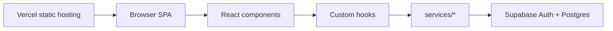

# Architecture Overview

BB Manager is a client-side React + TypeScript single-page app for managing Boys' Brigade members, marks, and settings across the `company` and `junior` sections.

The app is deployed as a static SPA on Vercel. The browser talks directly to Supabase for authentication and data access. There is no custom application server in this repo.

## Core Stack

- React 19 + TypeScript
- Vite for development and production builds
- Tailwind CSS via PostCSS
- Supabase Auth + Postgres
- Vercel for deployment

## Verified Live Supabase Shape

Verified on 2026-03-21:

- `profiles`
- `settings`
- `members`
- `marks`
- `invite_codes`

RLS is enabled on all of those tables.

## High-Level Data Flow

```mermaid
flowchart LR
  Browser["Browser SPA"]
  UI["React components"]
  Hooks["Custom hooks"]
  Services["services/*"]
  Supabase["Supabase Auth + Postgres"]
  Vercel["Vercel static hosting"]

  Vercel --> Browser
  Browser --> UI
  UI --> Hooks
  Hooks --> Services
  Services --> Supabase
```

## Major Layers

### 1. UI Layer

- `App.tsx` orchestrates auth state, active section, view switching, and modal/toast state.
- `components/*` implements pages and shared UI.
- Navigation is app-state driven rather than router-driven.

### 2. Hook Layer

- `useAuthAndRole` subscribes to Supabase auth and loads the current user's role from `profiles`.
- `useSectionManagement` persists the active section in `localStorage`.
- `useAppData` loads members and section settings for the active section.
- `useUnsavedChangesProtection` guards navigation while forms are dirty.
- `useToastNotifications` owns transient toast state.

### 3. Services Layer

- `services/supabaseClient.ts` creates the shared Supabase client.
- `services/supabaseAuth.ts` wraps auth operations.
- `services/db.ts` maps app models to the live tables:
  - `profiles` for app roles and user metadata
  - `members` for member records
  - `marks` for per-member attendance and scores
- `services/settings.ts` handles section-level settings.
- `services/errorMonitoring.ts` reports operational failures to `ntfy.sh`.

## State Model

Sources of truth:

- Supabase Auth session for authentication
- Supabase Postgres for application data
- `localStorage['activeSection']` for the selected section
- React component and hook state for loaded records and view state

The app does not maintain an offline cache or a separate backend API.

## Security Model

- The browser only receives public client credentials (`VITE_SUPABASE_URL`, `VITE_SUPABASE_ANON_KEY`).
- Authorization is enforced in Supabase, not in the client.
- Manual account provisioning is handled directly in Supabase; the app no longer exposes signup, recovery, or audit-log flows.
- Client-side role checks remain UX guardrails only.

See [docs/10-database-security-model.md](docs/10-database-security-model.md) for the current security summary.

## Deployment Model

- Local development uses the Vite dev server.
- Production uses `npm run build` and Vercel static hosting.
- `vercel.json` handles SPA rewrite-to-root behavior.

See [docs/03-getting-started.md](docs/03-getting-started.md) and [docs/04-deployment.md](docs/04-deployment.md).

## Guardrails

- Keep Supabase table names and docs aligned with the live schema.
- Do not add server-only deployment paths unless they are actually used in production.
- Prefer deleting dead runtime files and dependencies over documenting them as optional.
- Update docs in the same change when setup, schema, auth flow, or deployment behavior changes.
