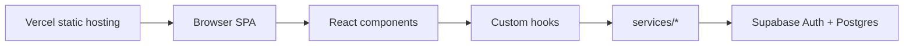

# Architecture Overview

BB Manager is a client-side React + TypeScript single-page app for managing Boys' Brigade members, marks, and settings across the `company` and `junior` sections.

The app is deployed as a static SPA on Vercel. The browser talks directly to Supabase for authentication and data access. There is no custom application server in this repo.

## Core Stack

- React 19 + TypeScript
- Vite for development and production builds
- Tailwind CSS via PostCSS
- Supabase Auth + Postgres
- Vercel for deployment

## Verified Live Supabase Shape

Verified on 2026-09-11:

- `profiles`
- `settings`
- `members`
- `marks`
- `bb_sessions`
- `archived_members`
- `archived_marks`

RLS is enabled on the current app tables.

## High-Level Data Flow

```mermaid
flowchart LR
  Browser["Browser SPA"]
  UI["React components"]
  Hooks["Custom hooks"]
  Services["services/*"]
  Supabase["Supabase Auth + Postgres"]
  Vercel["Vercel static hosting"]

  Vercel --> Browser
  Browser --> UI
  UI --> Hooks
  Hooks --> Services
  Services --> Supabase
```

## Major Layers

### 1. UI Layer

- `App.tsx` orchestrates auth state, active section, view switching, and modal/toast state.
- `components/*` implements pages and shared UI.
- `components/reports/*` contains the branded session PDF document used by the dashboard export flow.
- Navigation is app-state driven rather than router-driven.

### 2. Hook Layer

- `useAuthAndRole` subscribes to Supabase auth, loads the current user's role from `profiles`, treats a missing role as Access Denied, and handles password-recovery sessions.
- `useSectionManagement` persists the active section in `localStorage` after validating it.
- `useAppData` loads members and section settings for the active section.
- `useUnsavedChangesProtection` guards navigation while forms are dirty.
- `useToastNotifications` owns transient toast state.

### 3. Services Layer

- `services/supabaseClient.ts` creates the shared Supabase client.
- `services/supabaseAuth.ts` wraps auth operations.
- `services/db.ts` maps app models to the live tables:
  - `profiles` for app roles and user metadata
  - `members` for member records
  - `marks` for per-member attendance and scores
- `services/sessions.ts` lists closed BB years and starts a new session through `start_new_bb_session`.
- `services/reporting/sessionReport.ts` derives PDF-ready session reporting aggregates from loaded section data.
- `services/settings.ts` handles section-level settings, updating the seeded `company` and `junior` rows in place.

## State Model

Sources of truth:

- Supabase Auth session for authentication
- Supabase Postgres for application data
- `localStorage['activeSection']` for the selected section (validated to `company` | `junior`)
- `sessionStorage` for per-section roster search/sort
- React component and hook state for loaded records and view state

The app does not maintain an offline cache or a separate backend API.
The branded session PDF generator also runs fully client-side in the browser.

## Security Model

- The browser only receives public client credentials (`VITE_SUPABASE_URL`, `VITE_SUPABASE_ANON_KEY`).
- Authorization is enforced in Supabase, not in the client.
- Keep public signup disabled. Staff accounts are created in the Auth dashboard. Passkeys are required on the live site after a one-time password migration.
- Password reset uses `VITE_APP_URL` (or the current origin) as the Auth redirect. A reset password on production is temporary until a passkey is created.
- Passkeys are enabled on hosted Auth for `https://bb-manager.vercel.app`. Local and preview hosts cannot complete a WebAuthn ceremony against that relying party ID, so they keep email/password and do not run the migration gate.
- New-user onboarding is documented in [`docs/user-guide.md`](docs/user-guide.md).
- Client-side role checks remain UX guardrails only.
- `ErrorBoundary` plus `reportError` cover unexpected UI failures; there is no hosted error product configured.

See [docs/10-database-security-model.md](docs/10-database-security-model.md) for the current security summary.
See [docs/11-audit-remediation.md](docs/11-audit-remediation.md) for the 2026-09-11 closeout.

## Deployment Model

- Local development uses the Vite dev server.
- Production uses `npm run build` and Vercel static hosting.
- `vercel.json` handles SPA rewrite-to-root behavior.

See [docs/03-getting-started.md](docs/03-getting-started.md) and [docs/04-deployment.md](docs/04-deployment.md).

## Guardrails

- Keep Supabase table names and docs aligned with the live schema.
- Do not add server-only deployment paths unless they are actually used in production.
- Prefer deleting dead runtime files and dependencies over documenting them as optional.
- Update docs in the same change when setup, schema, auth flow, or deployment behavior changes.
