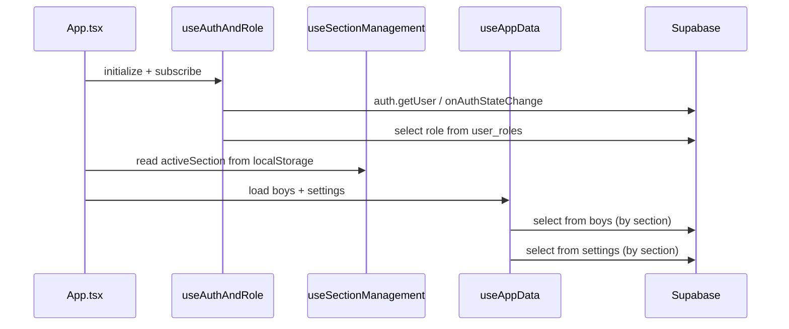

# 7. Hooks & State

[`ARCHITECTURE.md`](../ARCHITECTURE.md) is the canonical system model for this repo. This document is a focused
deep dive into the custom hooks and how state is coordinated in the client.

---

## Overview

BB Manager relies on a small set of custom hooks to keep cross-cutting concerns out of page
components:
- Auth + role loading (`useAuthAndRole`)
- Active section persistence (`useSectionManagement`)
- Core data loading (`useAppData`)
- Navigation protection for dirty forms (`useUnsavedChangesProtection`)
- Toast notifications (`useToastNotifications`)

The top-level `App.tsx` wires these hooks together and passes their outputs down into page
components as props.

---

## Hook Inventory

### `useAuthAndRole`

Location: `hooks/useAuthAndRole.ts`

Responsibilities:
- Subscribes to Supabase auth state changes and maps the session user to `AppUser`.
- Loads the user's application role from the `user_roles` table.
- Forces sign-out and shows a "no role" error when a user is authenticated but has no role.

Key outputs:
- `currentUser`, `userRole`, `noRoleError`, `authLoading`
- `performSignOut`, `setCurrentUser`, `setUserRole`

> TODO: Role fetching here queries `user_roles` directly via `supabaseClient`; consider
> centralizing in `services/db.ts` for consistency.

### `useSectionManagement`

Location: `hooks/useSectionManagement.ts`

Responsibilities:
- Persists the selected section (`company`/`junior`) to `localStorage` (`activeSection`).
- Provides helpers to select or clear the active section and reset view state.

Key outputs:
- `activeSection`, `setActiveSection`, `handleSelectSection`, `performSwitchSection`

### `useAppData`

Location: `hooks/useAppData.ts`

Responsibilities:
- Loads section-scoped application data when a user is authenticated and a section is set.
- Fetches the roster (`boys`) and section settings in parallel.
- Exposes a `refreshData()` method used after writes.

Key outputs:
- `boys`, `settings`, `dataLoading`, `dataError`, `refreshData`, `setSettings`

### `useUnsavedChangesProtection`

Location: `hooks/useUnsavedChangesProtection.ts`

Responsibilities:
- Wraps navigation, section switching, and sign-out so the user can be prompted when there
  are unsaved changes.
- Hooks `beforeunload` to prompt on browser/tab close when dirty.

Key outputs:
- `view`, `setView` (navigation wrapper)
- `confirmModalType`, `confirmAction`, `cancelAction`
- `handleSwitchSection`, `handleSignOut`

> TODO: Confirm the wiring between page-level "dirty" state and this hook’s
> `setHasUnsavedChanges` output.

### `useToastNotifications`

Location: `hooks/useToastNotifications.ts`

Responsibilities:
- Maintains a list of toast messages and provides `showToast`/`removeToast`.

Key outputs:
- `toasts`, `showToast`, `removeToast`

---

## End-to-End State Flow

---

## Client Persistence

Known `localStorage` keys used by the UI:
- `activeSection` (section selection)
- `homePageSearchQuery`, `homePageSortBy`, `homePageFilterSquad`, `homePageFilterYear`
  (Home page roster filters)

> TODO: Document whether these are considered stable UX features or implementation details.
