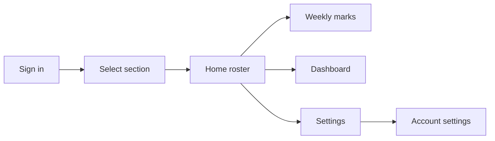

# BB Manager User Guide

This guide is the handout for new users. The app no longer ships an in-app help/manual screen.

## Quick Flow

## What Each Screen Does

| Screen | Purpose |
| --- | --- |
| `Sign in` | Authenticate with the email/password provided by an administrator. |
| `Select a Section` | Choose either the Company or Junior section. |
| `Home` | View, add, edit, and delete members in the active section. |
| `Weekly Marks` | Record attendance and marks for the selected meeting date. |
| `Dashboard` | Review summary charts, attendance trends, and generate the master end-of-session PDF. |
| `Section Settings` | Update section-level configuration such as the weekly meeting day. |
| `Account Settings` | Change your personal password. |

## Getting Started

1. Sign in with your Supabase account.
2. Choose the section you are responsible for.
3. Use `Home` to manage the member roster.
4. Use `Weekly Marks` for weekly attendance and scoring.
5. Use `Dashboard` when you want a quick summary of section performance or need the session PDF.

## Member Management

- Add a new member from `Home`.
- Edit member details directly from the roster or member detail screen.
- Delete members only when the record is no longer needed.

## Weekly Marks

- Pick the meeting date with the date control.
- Mark each member present or absent.
- Enter scores for present members.
- Save once you have finished the whole sheet.

## Dashboard

- Use the dashboard for a quick performance summary.
- Use `Generate Master PDF` to export one branded end-of-session report for the active section.
- Choose the session date range before downloading the report.
- The PDF includes section summary pages plus a detail page for each member with recorded marks in the selected range.
- It is reporting only. It does not change roster data.

## Settings

- `Section Settings` controls section-wide options.
- `Account Settings` only changes your own password.

## Support Notes

- Accounts are provisioned manually by an administrator.
- Keep this guide with the branch or release bundle you hand to new users.
