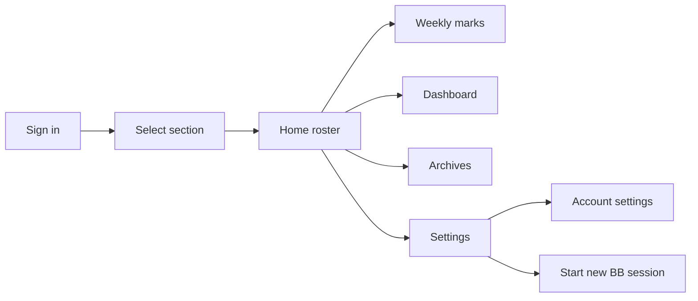

# BB Manager User Guide

This guide is the handout for new users. The app no longer ships an in-app help/manual screen.

## Quick Flow

```mermaid
flowchart LR
  A[Sign in] --> B[Select section]
  B --> C[Home roster]
  C --> D[Weekly marks]
  C --> E[Dashboard]
  C --> H[Archives]
  C --> F[Settings]
  F --> G[Account settings]
  F --> I[Start new BB session]
```

## What Each Screen Does

| Screen | Purpose |
| --- | --- |
| `Sign in` | Authenticate with the email/password provided by an administrator. Use Forgot password if you need a reset link. |
| `Select a Section` | Choose either the Company or Junior section. Log Out is labelled on this screen. |
| `Home` | View, add, edit, and delete members in the active section. |
| `Weekly Marks` | Record attendance and marks for the selected meeting date. New rows start as Not recorded. |
| `Dashboard` | Review summary charts, attendance trends, and generate the master end-of-session PDF. |
| `Archives` | Browse closed BB years and regenerate Master PDFs from archived members and marks. |
| `Section Settings` | Update the weekly meeting day. Captains and admins can also archive the current year and start a new session. |
| `Account Settings` | Change your personal password. You must enter your current password. |

## Getting Started

1. Sign in with the account an administrator created for you. Public self-signup is disabled.
2. Choose the section you are responsible for.
3. Manage the member roster from `Home`.
4. Record weekly attendance and scoring in `Weekly Marks`.
5. View section performance or download the session PDF from `Dashboard`. Closed years live under `Archives`.

## Member Management

- Add a new member from `Home`.
- Edit member details directly from the roster or member detail screen.
- Open a member's marks history, then use `Back to members` to return. Search and sort stay where you left them.
- Delete members only when the record is no longer needed.

## Weekly Marks

- Pick the meeting date with the date control.
- Attendance starts as `Not recorded`. Cycle Present → Absent → Not recorded.
- Enter scores for present members, then use `Save Marks`.
- Squad attendance percentages only count members you have marked present or absent.

## Dashboard

- Use the dashboard for a quick performance summary.
- Use `Generate Master PDF` to export one branded end-of-session report for the active section.
- The default range is the last 12 weeks of recorded marks. Narrow it if the page estimate is large.
- The PDF includes section summary pages plus a detail page for each member with recorded marks in the selected range.
- It is reporting only. It does not change roster data.

## Archives

- `Archives` lists closed BB years.
- Opening a session shows that year's members for the section you currently have selected.
- Generate the same Master PDF from archived data. The live Home roster is not changed by viewing an archive.

## Settings

- `Section Settings` controls the weekly meeting day.
- Captains and admins can **Start a new BB session**. That copies every live Company and Junior member and mark into Archives, then empties both live rosters so you can add the next year's boys.
- Type `START NEW SESSION` in the confirmation dialog. Meeting days and staff accounts stay as they are.
- `Account Settings` only changes your own password, and asks for the current password first.

## Support Notes

- Accounts are provisioned manually by an administrator.
- Keep this guide with the branch or release bundle you hand to new users.
