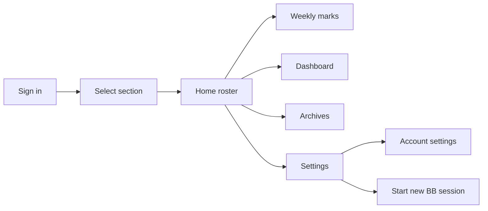

# BB Manager User Guide

This guide is the handout for new users. The app no longer ships an in-app help/manual screen.

## Quick Flow

```mermaid
flowchart LR
  A[Sign in] --> B[Select section]
  B --> C[Home roster]
  C --> D[Weekly marks]
  C --> E[Dashboard]
  C --> H[Archives]
  C --> F[Settings]
  F --> G[Account settings]
  F --> I[Start new BB session]
```

## What Each Screen Does

| Screen | Purpose |
| --- | --- |
| `Sign in` | On the live site, sign in with a passkey. The first time, sign in with the password an administrator set, create a passkey, then that password stops working. Local development still uses email/password. Use Forgot password only if you lose every passkey. |
| `Select a Section` | Choose either the Company or Junior section. Log Out is labelled on this screen. |
| `Home` | View, add, edit, delete, and import members in the active section. |
| `Weekly Marks` | Record attendance and marks for the selected meeting date. New rows start as Not recorded. |
| `Dashboard` | Review summary charts, attendance trends, and generate the master end-of-session PDF. |
| `Archives` | Browse closed BB years, regenerate Master PDFs, and import returning boys into this year. |
| `Section Settings` | Update the weekly meeting day and the section’s squad list. Captains and admins can also archive the current year and start a new session. |
| `Account Settings` | Add extra passkeys. On the live site you cannot remove the last passkey, and you cannot set a lasting password. |

## Getting Started

1. On `https://bb-manager.vercel.app`, sign in with the email/password an administrator created for you. You will be asked to create a passkey. After that, only the passkey works. Local development still uses email/password. Public self-signup is disabled.
2. Choose the section you are responsible for.
3. Manage the member roster from `Home`.
4. Record weekly attendance and scoring in `Weekly Marks`.
5. View section performance or download the session PDF from `Dashboard`. Closed years live under `Archives`.

## Member Management

- Add a new member from `Home`, or use **Import** to bring back boys from a past session.
- Import moves school year on by one (P4→P5, Year 8→9, and so on). Junior P7 join Company as Year 8. Year 14 have left and are not imported. Last year’s marks stay in Archives.
- Edit member details directly from the roster or member detail screen.
- Open a member's marks history, then use `Back to members` to return. Search and sort stay where you left them.
- Delete members only when the record is no longer needed.

## Weekly Marks

- After a meeting, Weekly Marks opens on that date for the next two days so last night’s scores can be entered without paging back.
- Pick a different meeting date with the date control.
- Attendance starts as `Not recorded`. Cycle Present → Absent → Not recorded.
- Enter scores for present members, then use `Save Marks`.
- Squad attendance percentages only count members you have marked present or absent.

## Dashboard

- Use the dashboard for a quick performance summary.
- Use `Generate Master PDF` to export one branded end-of-session report for the active section.
- The default range is the last 12 weeks of recorded marks. Narrow it if the page estimate is large.
- The PDF includes section summary pages plus a detail page for each member with recorded marks in the selected range.
- It is reporting only. It does not change roster data.

## Archives

- `Archives` lists closed BB years.
- Opening a session shows that year's members for the section you currently have selected.
- Generate the same Master PDF from archived data. Use **Import into this year** to copy returning boys onto the live roster with school year moved on. The archive itself is not changed.

## Settings

- `Section Settings` controls the weekly meeting day and the squad list for the selected section.
- Captains and admins can add, rename, or remove squads. A squad cannot be removed while members are still assigned to it.
- Captains and admins can **Start a new BB session**. That copies every live Company and Junior member and mark into Archives, then empties both live rosters so you can add the next year's boys.
- Type `START NEW SESSION` in the confirmation dialog. Meeting days and staff accounts stay as they are.
- `Account Settings` is where you add extra passkeys. Add them while signed in on `https://bb-manager.vercel.app`.
- On the live site, the first password sign-in is a one-time migration: you must create a passkey, then the old password is turned off. You cannot change back to a lasting password there.
- If you lose every passkey, use Forgot password, set a temporary password, sign in, add a new passkey before you sign out, then the temporary password is turned off.

## Support Notes

- Accounts are provisioned manually by an administrator.
- Keep this guide with the branch or release bundle you hand to new users.
